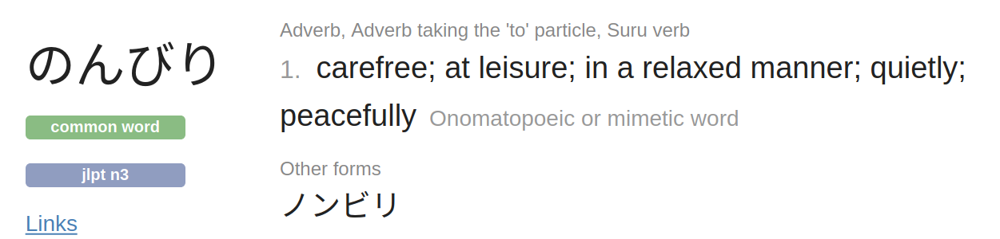

# purescript-halogen-nselect

[](https://circleci.com/gh/nonbili/purescript-halogen-nselect)

A Nonbili Select library in purescript halogen.

[Documentation and demo](https://nonbili.github.io/purescript-halogen-nselect/).

## Development

```
cd examples
yarn
spago build -w
yarn start
```

## Acknowledgement

This library was inspired by [downshift](https://github.com/downshift-js/downshift) and [purescript-halogen-select](https://github.com/citizennet/purescript-halogen-select).

[Differences from purescript-halogen-select](https://github.com/nonbili/purescript-halogen-nselect/issues/6).

## About

Nonbili means


